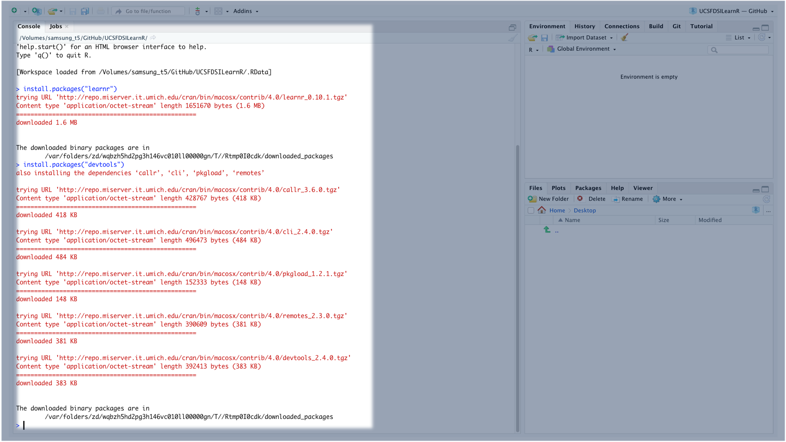
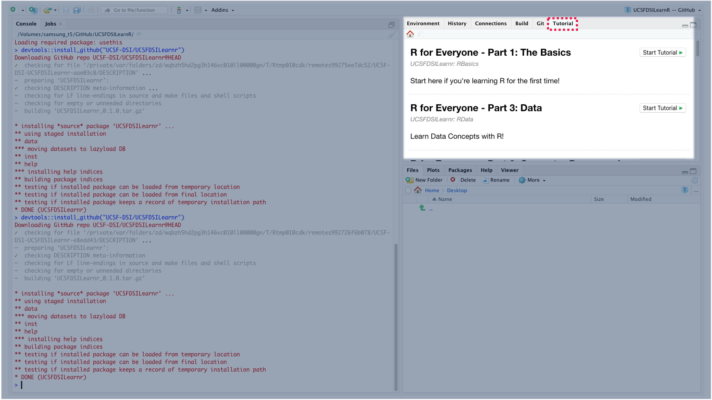
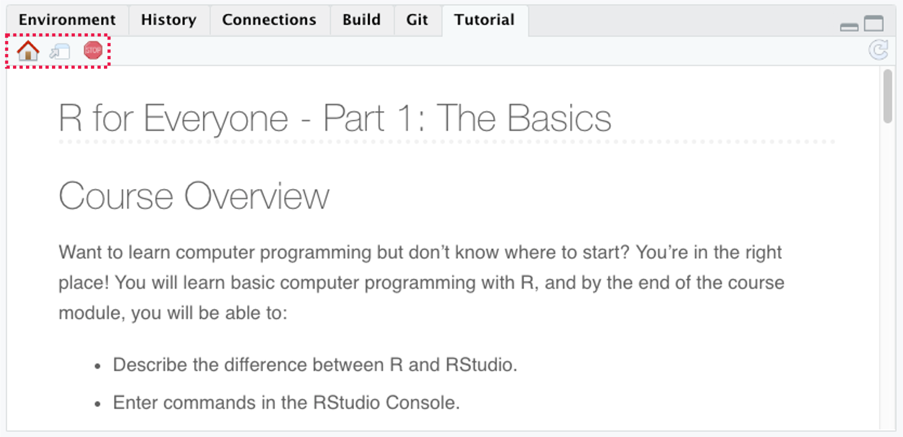

# Course Access Instructions

You'll need to have R and RStudio installed, and you'll access the self-paced R for Everyone modules directly inside of RStudio!

To access the modules, open RStudio, and you'll need to complete the following steps:

1.  Install learnr and devtools

2.  Load learnr and devtools

3.  Install UCSF DSI Courses

4.  Launch Courses

## Install learnr and devtools

You can skip this step of you've already previously installed *learnr* and *devtools* packages. However, there is not harm in re-installing these packages.

To install learnr and devtools, copy and paste the commands below into RStudio Console and press *Enter*.

    install.packages("learnr")
    install.packages("devtools")

## Load learnr and devtools

After you've installed *learnr* and *devtools*, you'll need to load them in your RStudio session. To do this, copy and paste the commands below into RStudio Console and press *Enter*.

    library(learnr)
    library(devtools)

## Install UCSF DSI Courses

After you'd loaded *learnr* and devtools, you can install R courses from UCSF DSI. Courses are constantly updated, and you should install the courses every time to ensure you are viewing the most up-to-date version of the course.

    devtools::install_github("UCSF-DSI/UCSFDSILearnr")

## Launch Courses

Now that the courses have been installed, you can access them in the Tutorial Pane at the top right of RStudio.

The courses in this series are:

-   R for Everyone - Part 1: The Basics

-   R for Everyone - Part 2: Computer Programming

-   R for Everyone - Part 3: Data

Begin a course by clicking *Start Tutorial*. We recommend viewing the course in a new window, and to do that, you'll just need to click the *Show in new window* icon at the top left of the Tutorial Pane.

You can stop or pause the course at any time, and RStudio will remember your progress.
