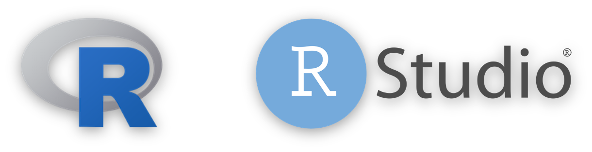
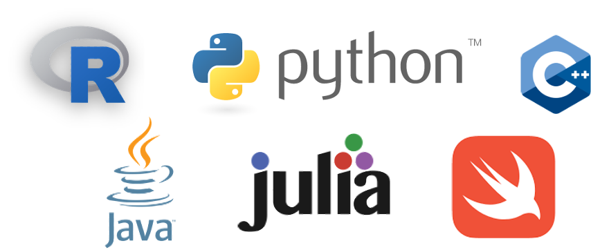

```{r setup, include=FALSE}
library(learnr)
knitr::opts_chunk$set(echo = FALSE)
```


## Lesson Objective
*Describe reasons to use RStudio to interact with R.*

{width="100%"}

You may have heard that R and RStudio are great tools for doing data science, but do you know what makes them useful? Also, what's the difference between R and RStudio?

## What is R?

**R** is a programming language used frequently for data science and statistical applications.

A **programming language** is a human-interpretable way to provide specific instructions to a computer. There are many programming languages out there, and some examples are Python, Javascript, and C++.

{width="100%"}

R is a great option for the following reasons:

-   It is free and open source.
-   There is a large community of R users (many of whom do data science) who provide support for each other.

<details>
<summary>
**R vs Python**
</summary>

Another popular language used for data science and statistical applications is Python. Although this course is R-based, both R and Python are excellent programming languages for beginners to learn.

To determine whether to start with R and Python, we recommend picking the language your friends and colleagues use. That way, they can support you as you are learning!
</details>

<br />

***Pro Tip**: Although it is useful to understand multiple programming languages, you should only learn one programming language at a time (especially if you are a beginner). Once you have mastered one programming language, then you can try learning others.*
