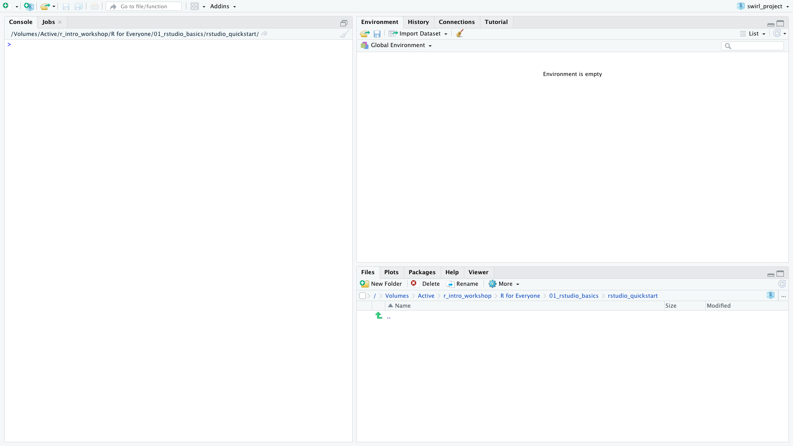

```{r setup, include=FALSE}
library(learnr)
knitr::opts_chunk$set(echo = FALSE)
```

## Getting Started

{width="100%"}

You may have heard that R and RStudio are great tools for doing data science, but do you know what makes them useful? Also, what's the difference between R and RStudio?

## What is R?

**R** is a programming language used frequently for data science and statistical applications.

A **programming language** is a human-interpretable way to provide specific instructions to a computer. There are many programming languages out there, and some examples are Python, Javascript, and C++.

{width="100%"}

R is a great option for the following reasons:

-   It is free and open source.
-   There is a large community of R users (many of whom do data science) who provide support for each other.

<details>

<summary>

**R vs Python**

</summary>

Another popular language used for data science and statistical applications is Python. Although this course is R-based, both R and Python are excellent programming languages for beginners to learn.

To determine whether to start with R and Python, we recommend picking the language your friends and colleagues use. That way, they can support you as you are learning!

</details>

<br />

***Pro Tip**: Although it is useful to understand multiple programming languages, you should only learn one programming language at a time (especially if you are a beginner). Once you have mastered one programming language, then you can try learning others.*

## What is RStudio?


Now that you know more about R, it's time to learn about RStudio. **RStudio** is an integrated development environment (IDE) used to interact with R.

Although you don't have to use one, an **IDE** is a type of software program that makes computer programming easier to do. As you learn more about RStudio, you'll see how some of its features make R programming more enjoyable.

For the most part, you will be doing R programming inside of RStudio. Visit [RStudio's website](https://www.rstudio.com/) to learn more about it.

## Knowledge Check

```{r KC-1, echo=FALSE}
question("TRUE or FALSE: RStudio is a programming language used frequently for data science and statistical applications.",
  answer("TRUE ", message = "Not quite. RStudio is an IDE used to interact with the R programming language."),
  answer("FALSE ", correct = TRUE, message = "That's right! Continue on to the next lesson to launch RStudio."),
  type="single",
  allow_retry = TRUE
)
```

## Launching RStudio

Let's try launching RStudio. If you haven't already, go ahead and open RStudio on your computer. You should see something like this.

{width="100%"}

### RStudio Console

First, let's take a look at the Console on the left side of the window. Inside the **Console**, you can enter R commands. Try entering `1 + 1` inside the Console and then pressing *Enter*.

{width="100%"}

You can think of the Console as a calculator, and many mathematical operators are built into the R programming language. For example, try entering `2 * 4 - 6 / 2` in the Console.

```{r KC-2, echo=FALSE}
question("What does the Console print after you enter `2 * 4 - 6 / 2`?",
  answer("5", correct = TRUE, message = "You got it! R maintains standard order of operations."),
  answer("1", message = "Not quite. Try again."),
  answer("-2", message = "Not quite. Try again."),
  answer("Something else...", message = "Not quite. Try again."),
  type="single",
  allow_retry = TRUE
)
```

***Pro Tip**: Inside the Console, you can use the up arrow key to find and re-enter previous commands.*

At this point, the Console is the only RStudio feature you should know about. As you progress through your R learning journey, you'll learn about other RStudio features. If you want to a sneak peek at all the RStudio features available, check out this [cheatsheet](https://github.com/rstudio/cheatsheets/raw/master/rstudio-ide.pdf) by the RStudio team.

## Summary

**Key Concepts**

-   R is a programming language used frequently for data science and statistical applications.
-   RStudio is an integrated development environment (IDE) used to interact with R.
-   Inside the RStudio Console, you can enter R commands.

| Vocabulary                               | Definition                                                                            |
|:-----------------------|:-----------------------------------------------|
| R                                        | A programming language used frequently for data science and statistical applications. |
| Programming Language                     | A human-interpretable way to provide specific instructions to a computer.             |
| RStudio                                  | An integrated development environment (IDE) used to interact with R.                  |
| Integrated Development Environment (IDE) | An computer application that supports programming tasks.                              |
| Console                                  | A space in RStudio where you can enter R commands.                                    |

**References**

-   *R: R Logo*. <https://www.r-project.org/logo/.>

-   *RStudio Logo Usage Guidelines*. <https://rstudio.com/about/logos/.>

-   "The Python Logo." *Python.Org*, <https://www.python.org/community/logos/.>

-   *Terms of Use: Standard C++*. <https://isocpp.org/home/terms-of-use.>

-   *Logos \| Oracle*. <https://www.oracle.com/legal/logos.html.>

-   *JuliaLang/Julia-Logo-Graphics*. 2014. The Julia Programming Language, 2021. *GitHub*, <https://github.com/JuliaLang/julia-logo-graphics.>

-   *Swift Resources - Apple Developer*. <https://developer.apple.com/swift/resources/.>
