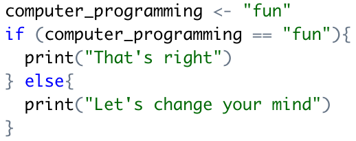
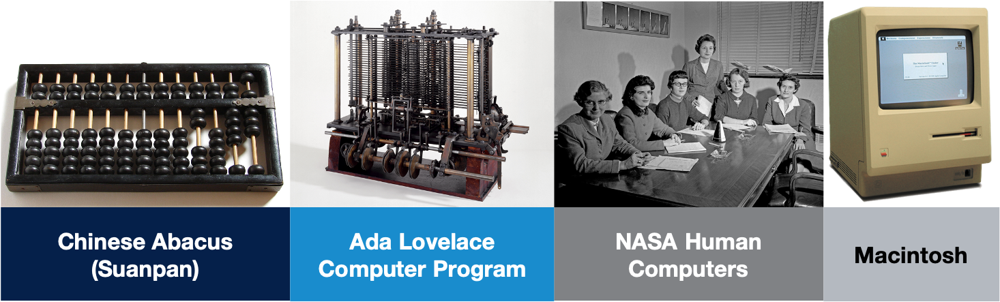
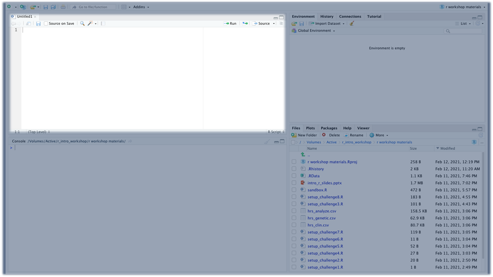
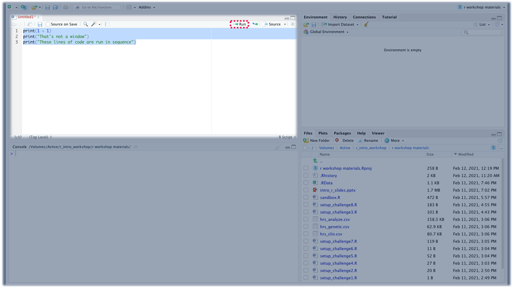

```{r setup, include=FALSE}
library(learnr)
knitr::opts_chunk$set(echo = FALSE)
```


## Getting Started

*Lesson Objective: Create and run R scripts.*

You now know a little bit more about R and RStudio, and at this point, you should be able to use the RStudio Console as a calculator. You may be unaware, but by entering commands into the RStudio Console, you are doing computer programming!

{width="353"}

Many people describe **computer programming** (often called **coding**) as creating executable instructions for computers. Let's unpack this.

## What are Computers?

> Computers do computing...

This may seem trivial, but let's first think about what computers are. Simply put, **computers** do computing, and one of the first images that may come to mind as you think about computers is the device you are interacting with right now.

However, computers encompass so much more. After all, this device you are interacting with isn't the only thing that did computing throughout history.

-   In 160-220, The Chinese used the Abacus (Suanpan) to do computing.
-   In the 1840s, Ada Lovelace created the first computer program using an "Analytical Engine"
-   In the 1950s, NASA hired people "computers" to do computing and help launch rockets into space.
-   In the 1980s, Apple came out with the Macintosh which was the first "personal computer."

{width="100%"}

Why does this matter? Your executable instructions, also called **computer programs**, are not only meant to be consumed by computing devices. Computer programs are designed to be interpreted by other "human" computers too. After all, we use programming languages because they are *human-interpretable* ways to provide instructions to computers.

## Computer Programming with R Scripts

One of the most common mediums for you to create computer programs with R is an R Script. In the RStudio Console, you can only enter a single R command at a time, but with **R Scripts**, you can include multiple commands to be run sequentially repeatedly.

To create an R Script in RStudio, go to *File* -\> *New File* -\> *R Script*. You should now see a new **Source Editor** pane appear above the Console.

{width="100%"}

Enter the following lines of code into the Source Editor:

    print(1 + 1)
    print("That's not a window")
    print("These lines of code are run in sequence")

Select all the code you entered, and then select *Run*.

{width="100%"}


You should then see the Console run all the code you entered into your R script. You can also run individual lines of code by selecting only a single line before selecting *Run*.

If you would like to re-use your code, be sure to save your R script. Then, the next time you open RStudio, you will be able to open the existing R Script and run it.

## Knowledge Check

```{r KC-1, echo=FALSE}
question("TRUE or FALSE: My R scripts don't need to be interpretable by anyone but me and R!",
  answer("TRUE ", message = "Not quite. Think about all the *computers* you are creating computer programs for."),
  answer("FALSE ", correct = TRUE, message = "That's right. You should strive to make your computer programs interpretable to all computers, including humans!"),
  allow_retry = TRUE
)
```

## Summary

**Key Concepts**

-   Many people describe **computer programming** (often called **coding**) as creating executable instructions for computers.
-   You can use **R Scripts** to create R computer programs with multiple commands.

| Vocabulary                    | Definition                                                                                           |
|:------------------------------|:-----------------------------------------------------------------------------------------------------|
| Computer Programming (Coding) | Creating executable instructions for computers.                                                      |
| R Script                      | An executable R program that can contain multiple R commands.                                        |
| Source Editor                 | A pane in RStudio where you can edit R Scripts and other types of files.                             |

**References**

-   Tribble, David R. *Abacus 5.jpg*. <https://commons.wikimedia.org/wiki/File:Abacus_5.jpg>

-   "Ada Lovelace and the Abstract Machine - Essay - Technology." *TLS*, [www.the-tls.co.uk/articles/ada-lovelaces-abstract-machine/](www.the-tls.co.uk/articles/ada-lovelaces-abstract-machine/).

-   "The Women of NASA." *National Women's History Museum*, [www.womenshistory.org/exhibits/women-nasa.](www.womenshistory.org/exhibits/women-nasa)

-   Wikipedia contributors. "Macintosh 128K." *Wikipedia*, [en.wikipedia.org/wiki/Macintosh_128K.](en.wikipedia.org/wiki/Macintosh_128K)
