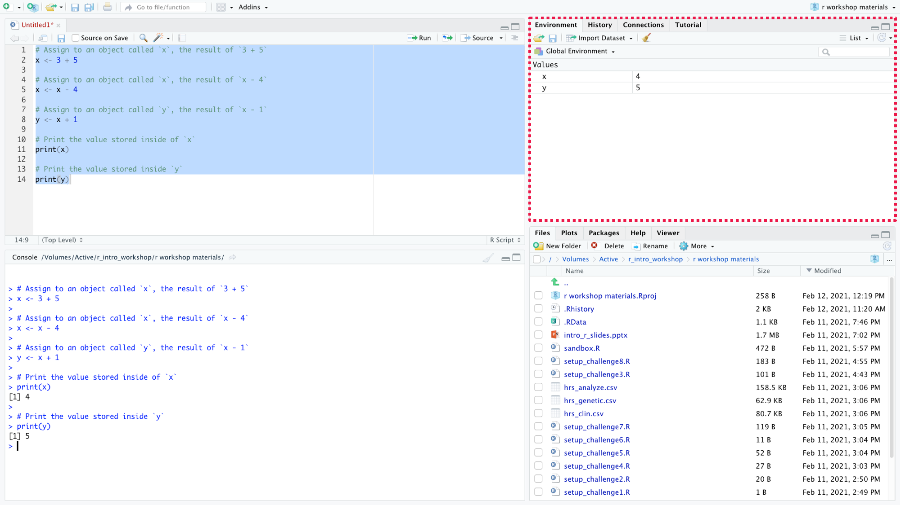

```{r setup, include=FALSE}
library(learnr)
knitr::opts_chunk$set(echo = FALSE)
```


## Getting Started

Let's begin with a quick warm-up exercise. Go ahead and adjust the code below by uncommenting `print(x)` and `print(y)` (see Pro Tip). Then, run your code and answer the two quiz questions.

```{r exercise_01a, exercise=TRUE}
# Assign to an object called `x`, the result of `3 + 5`
x <- 3 + 5

# Assign to an object called `x`, the result of `x - 4`
x <- x - 4

# Assign to an object called `y`, the result of `x + 1`
y <- x + 1

# Print the value stored inside of `x`
# print(x)

# Print the value stored inside `y`
# print(y)
```

```{r exercise_01a-solution}
# Assign to an object called `x`, the result of `3 + 5`
x <- 3 + 5

# Assign to an object called `x`, the result of `x - 4`
x <- x - 4

# Assign to an object called `y`, the result of `x + 1`
y <- x + 1

# Print the value stored inside of `x`
print(x)

# Print the value stored inside `y`
print(y)
```

***Pro Tip**: The lines of code that start with `#` are called comments. **Comments** are annotations you include in your code to help humans (including yourself!) better understand your thought process, and computers will ignore your comments when running your code.*

```{r exercise_01b, echo=FALSE}
quiz(
  caption = "Answer the following questions:",
  question("What is the value of x?",
    answer("8"),
    answer("4", correct = TRUE),
    answer("5"),
    answer("Something else"),
    allow_retry = TRUE
  ),
  question("What is the value of y?",
    answer("8"),
    answer("4"),
    answer("5", correct = TRUE),
    answer("Something else"),
    allow_retry = TRUE
  )
)

```

## What are Objects?

**Objects** (also called **variables**) store values for later use. In the warm-up exercise, `x` and `y` were the objects, and we used the **assignment operator** (`<-`) to assign values to them. As you saw, objects can be used in mathematical operations, and you can rewrite and update the values stored in objects.

You can choose any name for objects, but here are a few rules about object naming in R:

-   Object names cannot include spaces (e.g. `num obj`) or mathematical operators (`num-obj`).
-   Object names cannot start with underscores or numbers (e.g. `_obj` and `2obj`).
-   Object names can include upper/lower case letters, numbers, underscores, and periods.
-   Object names are case sensitive (e.g. `num_obj` and `Num_obj` are not the same).

Here are our styling recommendations when creating object names:

-   Use **snake_case**:

    -   All lower case letters
    -   use underscore(`_`) to separate words

-   Use nouns that describe the value that the object contains

    -   Avoid using verbs as object names (until you learn about functions). You'll understand the reasoning later when you learn about *functions*.

***Pro Tip**: As we mentioned, it's important to make your code easy to read and interpret. One way to do that is to follow a style guide. Our R styling recommendations will be mostly based on [this style guide](http://adv-r.had.co.nz/Style.html) by Hadley Wickham.*

## The RStudio Environment Pane

Now try running the code from the warm-up exercise inside of RStudio. We recommend applying what you previously learned and running it all from a R Script.

    # Assign to an object called `x`, the result of `3 + 5`
    x <- 3 + 5

    # Assign to an object called `x`, the result of `x - 4`
    x <- x - 4

    # Assign to an object called `y`, the result of `x + 1`
    y <- x + 1

    # Print the value stored inside of `x`
    print(x)

    # Print the value stored inside `y`
    print(y)

After you run the code, you should see some changes in the top-right pane in RStudio.

{width="100%"}

This area is called the **Environment** pane, and as you can see, it displays a list of objects and their values. The Environment pane is another useful feature in the RStudio IDE that will make computer programming more enjoyable.

## Knowledge Check

```{r KC1, echo=FALSE}
quiz(
  caption = "Answer the following questions:",
  question("Which of the following are valid object names? Select all that apply.",
    answer("`blood_pressure`", correct = TRUE),
    answer("`bp`", correct = TRUE),
    answer("`bloodPressure`", correct = TRUE),
    answer("`measure-BP`"),
    allow_retry = TRUE,
    type="multiple"
  ),
  question("Which of the following object names follow our styling recommendations? Select all that apply.",
    answer("`blood_pressure`", correct = TRUE),
    answer("`bp`", message = "Not quite. Without more context, you cannot tell what `bp` represents."),
    answer("`bloodPressure`", message = "Not quite. This type of naming is called **camelCase**, and it's more commonly used for other programming languages. Although it is not recommended based on Hadley Wickham's style guide, there are other R style guides that may recommend it."),
    answer("`measure-BP`", message = "Not quite. This is not a valid object name because it contains a mathematical operator `-`."),
    allow_retry = TRUE,
    type="multiple"
  )
)

```

## Summary

**Key Concepts**

-   You can store values inside of **objects** and reuse them.
-   The **Environment pane** in RStudio contains a current list of objects and their values.

| Vocabulary                    | Definition                                                                                           |
|:------------------------------|:-----------------------------------------------------------------------------------------------------|
| Comments                      | Annotations that you include in your code to make it more interpretable.                             |
| Objects (Variables)           | Stores values for later use.                                                                         |
| Assignment operator (`<-`)    | Used to assign values to objects.                                                                    |
| snake_case                    | A way of naming objects that uses all lowercase characters and separates words using underscore(\_). |
| Environment Pane              | A pane on the top right of RStudio that contains a list of your current objects and their values.    |

**References**

-   Wickham, Hadley. *Style Guide*. [adv-r.had.co.nz/Style.html](adv-r.had.co.nz/Style.html).
