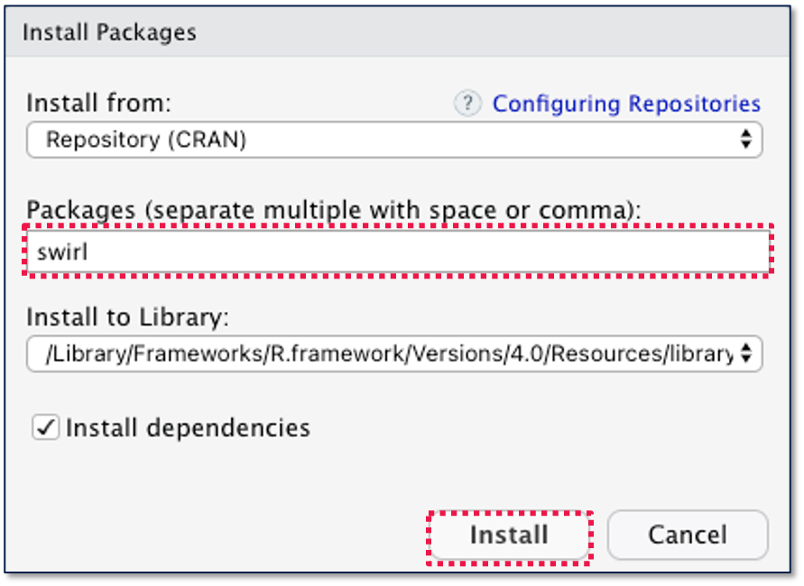

```{r setup, include=FALSE}
library(learnr)
knitr::opts_chunk$set(echo = FALSE)
```


## Getting Started

*Lesson Objectives: Define and call functions.*

While coding, in additional to the mathematical and logical operators you learned so far, you can also use functions. For example, take a look at the `sum` function below.

```{r exercise_04a, exercise=TRUE}
x <- 1
y <- 2
z <- sum(x, y)

print(z)
```

Think of **functions** as blocks of code the completes a specific task on a set of inputs. In the example above, when you **called** (used or invoked) the `sum` function on `x` and `y`, it produced the sum of 1 and 2.

## Installing Functions through R Packages

R comes with hundreds of functions, and you can see a list of them by entering `help(package = 'base')` into the Console. In addition, you can also install additional functions through packages. You can see a list of available packages by selecting the **Packages** pane on the lower right in RStudio

{width="100%"}

To install a package select *Tools* -\> *Install Packages...* from the top menu. Then type in the name of the package you would like to install, and click *Install*. For this example, you can install the `swirl` package, which is a package that contains R programming tutorials.

{width="71%"}

Once you have installed a package, you can load it by using the `library` command. The code below loads the `swirl` package.

    library(swirl)

Once `swirl` has been loaded, you can call the functions within `swirl`. Feel free to try out some of the tutorials within `swirl`.

***Pro Tip**: Later in your R programming journey, you will learn to create your own R packages, and distribute them to other R users. This is a great way to share your knowledge with the R community!*

## Defining Functions

In addition to calling functions and installing more functions through packages, you can also **define** or create your own custom functions. For example, in the code below, we define a function called `convert_inches_cm` that performs unit conversations between cm and inches.

```{r exercise_04b, exercise=TRUE}
convert_in_cm <- function(measurement, unit) {
  if (unit == "in"){
    conversion <- measurement * 2.54
  } else if (unit == "cm"){
    conversion <- measurement / 2.54
  } 
  return(conversion)
}

# Try adjusting the code below so `result` contains 3 cm converted to in.
result <- convert_in_cm(measurement=5, unit="in")
print(result)
```

```{r exercise_04c, echo=FALSE}
question("How many inches is 3 cm?",
  answer("1.181102", correct = TRUE),
  answer("7.62"),
  answer("Something else"),
  allow_retry = TRUE
)
```

Let's breakdown some key aspects of defining functions:

-   Functions are stored in objects: Just like values, functions are stored in objects. Unlike objects that contain values, we recommend using object names that start with verbs for functions.
-   Functions contain arguments: **Arguments** are inputs into the function. In our `convert_in_cm` example, `measurement` and `unit` were the arguments.
-   Functions **return** the value within the `return()` function: In our example, when we execute `result <- convert_in_cm(measurement=5, unit="in")`, the `result` object will contain the value stored in `conversion` when its used in `return(conversion)`.

***Pro Tip**: Organize your code into short functions that each convey a single idea. This will make your code easier to interpret.*

## Knowledge Check

Define a function named `convert_fahrenheit_celcius`. The function will convert temperatures between Fahrenheit and Celsius, and it will contain the following arguments:

-   `temperature`: A value representing the temperature in either
-   `unit`: Either "F" or "C" based on whether the input temperature is Fahrenheit or Celsius.

Here is a conversion formula between Fahrenheit and Celsius:

(32**°F** − 32) × 5/9 = 0**°C**

Once you have defined your function, call your function to convert -14 degree Fahrenheit to Celsius.

You can reveal the solution once you are comfortable with your response

```{r KC4, exercise=TRUE, exercise.lines=15}
# YOUR WORK HERE
```

```{r KC4-solution}
convert_fahrenheit_celcius <- function(temperature, unit) {
  if (unit == "F"){
    conversion <- (temperature - 32) * (5 / 9)
  } else if (unit == "C"){
    conversion <- (9 / 5) * temperature + 32
  } 
  return(conversion)
}

print(convert_fahrenheit_celcius(temperature=-14, unit="F"))
```

```{r KC4-question, echo=FALSE}
question("What is -14 degree Fahrenheit in Celsius?",
  answer("-10"),
  answer("6.8"),
  answer("-25.55556", correct = TRUE),
  answer("Something else"),
  allow_retry = TRUE
)
```

## Summary

| Vocabulary                    | Definition                                                                                           |
|:------------------------------|:-----------------------------------------------------------------------------------------------------|
| Functions                     | A block of code the completes a specific task on a set of inputs.                                    |
| Call                          | Use or invoke a function.                                                                            |
| Packages                      | Collection of functions that you can install.                                                        |
| Define                        | Create a new function.                                                                               |
| Arguments                     | Inputs into a function.                                                                              |
| Return                        | The resulting value of a function. You can specify this using the `return()` function.               |
