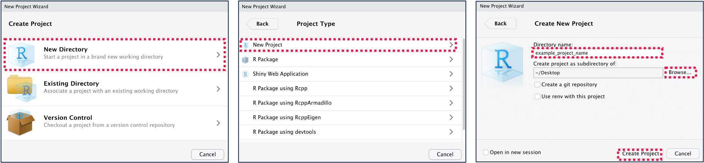
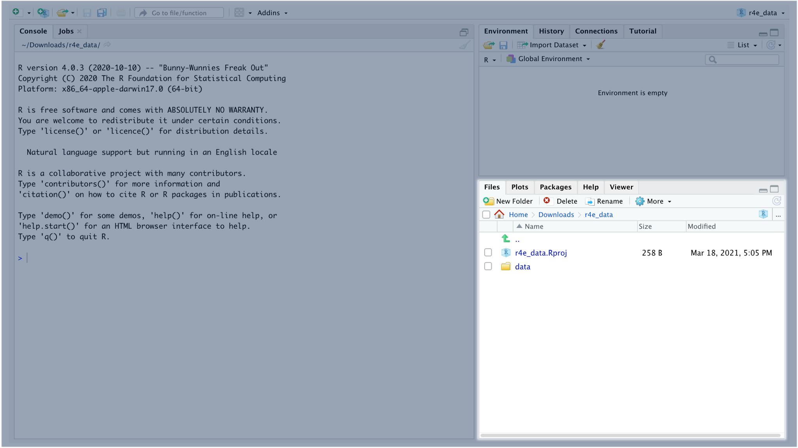

```{r setup, include=FALSE}
library(learnr)
knitr::opts_chunk$set(echo = FALSE)
```

## Getting Started

With a matrix, you can now work with 2-dimensional data. However, one of matrix's limitations (or feature depending on your perspective) is that all values must be the same type. However, the data you're working with often contains multiple types of values.

To explore this, go ahead and run the code below.

```{r exercise_03setup, include=FALSE}
dir.create("data")
course_records <- read.csv(url("https://raw.githubusercontent.com/UCSF-DSI/UCSFDSILearnr/main/data/course_records.csv"))
write.csv(course_records, "data/course_records.csv", row.names=FALSE)
rm(list=ls())
```

```{r exercise_03a, exercise=TRUE, exercise.setup="exercise_03setup"}
# Read data from course_records.csv and assign it to course_records
course_records <- read.csv("data/course_records.csv")
course_records
```

In the code above, we imported data from a **CSV (comma separated values)** file, using the `read.csv()` function. The data is now stored as a data frame in the *course_records* object.

## RStudio Projects

Up to this point in the R for Everyone series, you haven't needed to set up an RStudio Project. However, now that we'll start working with data files, it's a good idea to get into the habit of using RStudio Projects to organize your work..

By using **RStudio Projects**, you can ensure all the data, code, and documentation for your projects are accessible in a single place.

To create a new project, go to *File -\> New Project...\** from the top menu. In the window the appears, select *New Directory -\> New Project*. Then give your project a name and choose where to save your project.

*\* Notes:*

-   *Creating or opening a new RStudio Project will close this tutorial. No worries though! You can resume this tutorial from where you left off in the new RStudio Project.*

-   *In older versions of RStudio, this may be displayed as Empty Project instead of New Project.*



This will create a new folder in the location where you chose to save your new project. In this folder, you should now see a *.Rproj* file. You can use this *.Rproj* file as a shortcut to opening your project in RStudio.

Go ahead and create a new *.Rproj* to organize your work for this course module. Inside of the project folder, create a new *data* directory. To do this, you can select *New Folder* from the menu in the **Files** pane, which is located at the bottom right of the RStudio window.

{width="100%"}

If you are following along in the RStudio console, go ahead and download [this csv file](https://drive.google.com/uc?export=download&id=1Br49EnqLiUUP-lGE2LO2ZA4WE1jVC23g), and add it to your *data* folder in your project.

## What are Data Frames?

**Data frames** are the most common way of storing data in R, and it handles **tabular data** (data with rows and columns) with multiple data types. The *course_records* data frame contains multiple types of data:

```{r exercise_03setup1, include=FALSE}
dir.create("data")
course_records <- read.csv(url("https://raw.githubusercontent.com/UCSF-DSI/UCSFDSILearnr/main/data/course_records.csv"))
```

```{r exercise_03a1, exercise=TRUE, exercise.setup="exercise_03setup1"}
course_records
```

-   The *Name* column contains strings.

-   The *Grade* column contains integers.

-   The *Week.XXX.Attendance* columns contain boolean values.

-   The *XXX.Assessment.Score* columns contain numeric (decimal) values.

***Pro Tip**: You can view your data frames in your Environment Pane, by clicking an object that contains the data frame you would like to view*

## Indexing Data Frames

Similar to vectors and matrices, we use square brackets (`[ ]`) to index data frames. In fact, indexing data frames is very similar to indexing matrices.

```{r exercise_03bsetup, include=FALSE}
course_records <- read.csv(url("https://raw.githubusercontent.com/UCSF-DSI/UCSFDSILearnr/main/data/course_records.csv"))
```

```{r exercise_03b, exercise=TRUE, exercise.setup="exercise_03bsetup"}

# Select all columns in the first row
course_records[1, ]

# Select all rows in the second column
course_records[, 2]

# Select the pre and post assessment scores from the first 10 rows
course_records[
  1:10,
  c("Pre.Assessment.Score", "Post.Assessment.Score")
]
```

Similar to indexing matrices, you can use logic to index data frames.

```{r exercise_03c, exercise=TRUE, exercise.setup="exercise_03bsetup"}

# Select students who were present during week 5
course_records[
  course_records[, "Week.5.Attendance"] == TRUE, 
  "Name"
]
```

## Knowledge Check

Consider the following scenario for this multi-part Knowledge Check.

Suppose now we want to find students who were "exceptional" throughout the course. The criteria for exceptional students are:

-   Scored higher on the post assessment than the pre assessment

-   Scored at least 0.8 on the post assessment

-   Attended at least 4 classes

In addition, you'll need to apply a grade adjustment and add 0.1 to both assessments prior to selecting students based on this criteria.

Let's work through this one step at a time.

### Part A: Adjust Assessment Columns in Data Frame

First let's apply a grade adjustment and add 0.1 to both assessments.

The data is stored in `course_records`. The data for the assessments are located in the `Pre.Assessment.Score` and `Post.Assessment.Score` columns. Go ahead and use indexing to add 0.1 to all scores in both assessments. Print the updated `course_records` data frame.

```{r KC3A, exercise=TRUE, exercise.lines=10, exercise.setup="exercise_03bsetup"}
# YOUR WORK HERE

# Apply a grade adjustment of 0.1 to both assessments


# Print `course_records`


```

```{r KC3A-solution}

# Apply a grade adjustment of 0.1 to both assessments
course_records[, c("Pre.Assessment.Score", "Post.Assessment.Score")] <- course_records[, c("Pre.Assessment.Score", "Post.Assessment.Score")] + 0.1

# Print `course_records`
course_records
```

### Part B: Create Logical Vectors Based on Criteria

Next, create logical vectors that will represent the criteria for "exceptional" students:

-   Criteria 1: Attended at least 4 classes

-   Criteria 2: Scored higher on the post assessment than the pre assessment

-   Criteria 3: Scored at least 0.8 on the post assessment

Store these vectors in `criteria_1`, `criteria_2`, `criteria_3`. We provided `criteria_1` for you (*recommendation: review the documentation for the `rowSums()` function*), but you need to write code to create `criteria_2` and `criteria_3`.

```{r KC3B, exercise=TRUE, exercise.lines=15, exercise.setup="exercise_03bsetup"}
# Apply a grade adjustment of 0.1 to both assessments
course_records[, c("Pre.Assessment.Score", "Post.Assessment.Score")] <- course_records[, c("Pre.Assessment.Score", "Post.Assessment.Score")] + 0.1

# Create criteria_1 vector (Attended at least 4 classes)
criteria_1 <- rowSums(course_records[, c("Week.1.Attendance", "Week.2.Attendance", "Week.3.Attendance", "Week.4.Attendance", "Week.5.Attendance")]) >= 4

# YOUR WORK HERE

# Create criteria_2 vector (Scored higher on the post assessment than the pre assessment)


# Create criteria_3 vector (Scored at least 0.8 on the post assessment)


```

```{r KC3B-solution}

# Apply a grade adjustment of 0.1 to both assessments
course_records[, c("Pre.Assessment.Score", "Post.Assessment.Score")] <- course_records[, c("Pre.Assessment.Score", "Post.Assessment.Score")] + 0.1

# Create criteria_1 vector (Attended at least 4 classes)
criteria_1 <- rowSums(course_records[, c("Week.1.Attendance", "Week.2.Attendance", "Week.3.Attendance", "Week.4.Attendance", "Week.5.Attendance")]) >= 4

# Create criteria_2 vector (Scored higher on the post assessment than the pre assessment)
criteria_2 <- course_records[, "Post.Assessment.Score"] - course_records[, "Pre.Assessment.Score"] > 0

# Create criteria_3 vector (Scored at least 0.8 on the post assessment)
criteria_3 <- course_records[, "Post.Assessment.Score"] >= 0.8
```

### Part C: Use Criteria Vectors to Index Data Frame

Now we can index course_records to view "exceptional" students. Use the criteria vectors you created in Part B to select students who meet all three criteria (*hint: you'll need to use the `&` operator*). Make sure you select the `Name` column from `course_records`, and you will store the results in an object called `top_performers`.

```{r KC3C, exercise=TRUE, exercise.lines=25, exercise.setup="exercise_03bsetup"}
# Apply a grade adjustment of 0.1 to both assessments
course_records[, c("Pre.Assessment.Score", "Post.Assessment.Score")] <- course_records[, c("Pre.Assessment.Score", "Post.Assessment.Score")] + 0.1

# Create criteria_1 vector (Attended at least 4 classes)
criteria_1 <- rowSums(course_records[, c("Week.1.Attendance", "Week.2.Attendance", "Week.3.Attendance", "Week.4.Attendance", "Week.5.Attendance")]) >= 4

# Create criteria_2 vector (Scored higher on the post assessment than the pre assessment)
criteria_2 <- course_records[, "Post.Assessment.Score"] - course_records[, "Pre.Assessment.Score"] > 0

# Create criteria_3 vector (Scored at least 0.8 on the post assessment)
criteria_3 <- course_records[, "Post.Assessment.Score"] >= 0.8

# YOUR WORK HERE

# Select students who met the criteria and assign to `top_performers`


# Print `top_performers`

```

```{r KC3C-solution}

# Apply a grade adjustment of 0.1 to both assessments
course_records[, c("Pre.Assessment.Score", "Post.Assessment.Score")] <- course_records[, c("Pre.Assessment.Score", "Post.Assessment.Score")] + 0.1

# Create criteria_1 vector (Attended at least 4 classes)
criteria_1 <- rowSums(course_records[, c("Week.1.Attendance", "Week.2.Attendance", "Week.3.Attendance", "Week.4.Attendance", "Week.5.Attendance")]) >= 4

# Create criteria_2 vector (Scored higher on the post assessment than the pre assessment)
criteria_2 <- course_records[, "Post.Assessment.Score"] - course_records[, "Pre.Assessment.Score"] > 0

# Create criteria_3 vector (Scored at least 0.8 on the post assessment)
criteria_3 <- course_records[, "Post.Assessment.Score"] >= 0.8

# Select students who met the criteria and assign to `top_performers`
top_performers <- course_records[criteria_1 & criteria_2 & criteria_3, "Name"]

# Print `top_performers`
top_performers
```

## Summary

**Key Concepts**

-   By using **RStudio projects**, you can ensure all the data, scripts, and documentation for your projects are in a single place.
-   Use the `c()` function to create **vectors**.
-   For 2-dimensional data, use **matrices** if all the values are the same type and **data frames** if the values are different types.
-   Use square brackets (`[ ]`) to **index** data in vectors, matrices, and data frames.

| Vocabulary                   | Definition                                                                                       |
|------------------------------|--------------------------------------------------------------------------------------------------|
| RStudio Projects             | A RStudio feature to organize all files and settings associated with each project.               |
| Files Pane                   | A pane on the bottom right of RStudio that displays your files and directories.                  |
| Vector                       | A sequence of values.                                                                            |
| Index                        | Select specific values within a vector, matrix, or dataframe.                                    |
| Length                       | The number of values in a vector. It also refers to the number of rows in a matrix or dataframe. |
| Comma Separated Values (CSV) | A file format that stores multiple values by separating them with commas.                        |
| Tabular Data                 | Data that can be displayed in a table (rows and columns)                                         |
